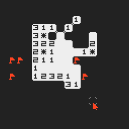

# MINESWEEPER for UXN

Minesweeper implemented in [UXNTAL][] for [UXN][]! YEAH!

[UXNTAL]: https://wiki.xxiivv.com/site/uxntal.html
[UXN]: https://100r.co/site/uxn.html



## Controls

`left mouse button` - open cell\
`right mouse button` - flag/unflag cell

## Building

```sh
./build.sh
uxnemu -2x bombswp.rom
```

## License

Distributed as public domain

Do whatever you want
